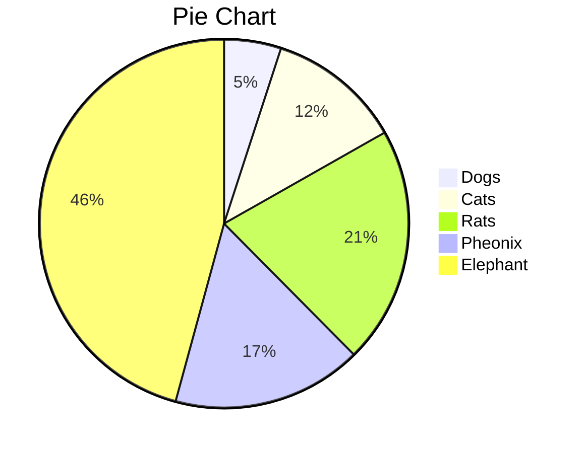

# IF YOUR ACTIONS INSPIRE OTHERS TO DREAM MORE, LEARN MORE, DO MORE AND BECOME MORE, YOU ARE A LEADER.

 
> Read Aloud is the most effective method of teaching reading because with this method we can condition the brain to associate reading as a fun activity. It also creates basic knowledge, builds a collection of words/vocabularies (vocabulary), and provides a good reading role model.

## Features

- Decrypt and encrypt text (access token: 233):
  - secret msg example:
  
Encrypted content!

### Directory

| Dir Name  | Alias | Link | Comment |
| :----------- | :-------- | :------ | :--------------------- |
| Posts | 投稿  | Archives  | Allowed |
| Tools | ツール | Archives | Not Allowed |
| Note | ノート | Archives    | Allowed |
| Gallery | マイギャラリー | Archives | Not Allowed |
| Portfolio | ポートフォリオ | Archives | Not Allowed |

### Pie Chart

